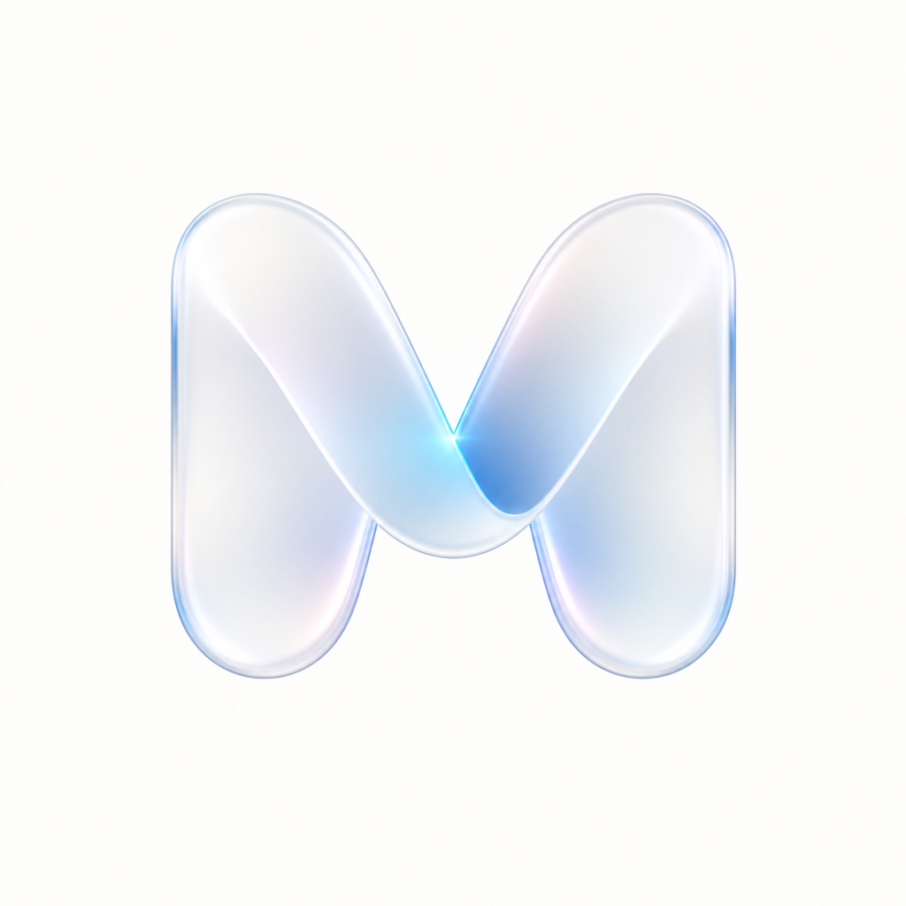

  

    
  

  <h1>Mira</h1>
  

    An iOS-first design system encyclopedia for AI-assisted UI design.
  

  

    <a href="#english-guide"><kbd><strong>English Guide</strong></kbd></a>
    &nbsp;·&nbsp;
    <a href="#zh-guide"><kbd>中文说明</kbd></a>
    &nbsp;·&nbsp;
    <a href="skills/mira-ios-design-system/SKILL.md"><kbd>Design Skill</kbd></a>
    &nbsp;·&nbsp;
    <a href="docs/design-system/overview.md"><kbd>Design Docs</kbd></a>
  

  
<strong>English</strong>

  

    Mira is a small but opinionated design reference system for iOS and SwiftUI.
    It exists because generic design skills are often unstable when asked to produce a specific visual style:
    they may understand the mood, but miss the tokens, component behavior, accessibility rules, or native iOS details.
  

  

    The long-term goal is to cover most mainstream interface styles and make each one usable through a stable skill.
    A style in Mira is not just a name. It should have a standard <code>Design.md</code>, practical rules, reference demos,
    and enough SwiftUI guidance for an AI agent to generate UI that is closer to implementation-ready.
  

  <h3>What Mira Provides</h3>

  <ul>
    <li><strong>Standard style documents</strong>: every style owns <code>docs/design-system/styles/&lt;style-slug&gt;/Design.md</code>.</li>
    <li><strong>Reference demos</strong>: implemented styles include iOS screens and component examples inside the app.</li>
    <li><strong>A usable AI skill</strong>: <code>skills/mira-ios-design-system/SKILL.md</code> routes agents to the right source docs instead of copying long style text.</li>
    <li><strong>Project rules</strong>: <code>project-standards/</code> keeps SwiftUI implementation, naming, accessibility, and vibe-coding expectations consistent.</li>
  </ul>

  <h3>Current Styles</h3>

  <table>
    <thead>
      <tr>
        <th align="left">Style</th>
        <th align="left">Status</th>
        <th align="left">Notes</th>
      </tr>
    </thead>
    <tbody>
      <tr>
        <td><strong>Apple Liquid Glass</strong></td>
        <td>Implemented</td>
        <td>Mira's default app shell style, with a light, native, glass-like home and detail experience.</td>
      </tr>
      <tr>
        <td><strong>Neumorphism / Soft UI</strong></td>
        <td>Implemented</td>
        <td>Soft raised and inset surfaces, paired shadows, tactile controls, and an independent detail page.</td>
      </tr>
      <tr>
        <td><strong>Neo-Brutalism</strong></td>
        <td>Implemented</td>
        <td>Thick borders, hard offset shadows, saturated blocks, pressed states, and component demos.</td>
      </tr>
      <tr>
        <td><strong>Glassmorphism</strong></td>
        <td>Documented / demo pending</td>
        <td>Registered as a style with a dedicated design document; the independent app demo is still pending.</td>
      </tr>
      <tr>
        <td><strong>Acid Graphic</strong></td>
        <td>Documented / demo pending</td>
        <td>Registered as an experimental visual style; the implementation module will be expanded later.</td>
      </tr>
    </tbody>
  </table>

  <h3>Using the Mira Design Skill</h3>

  

    Start from the skill entry:
    <code>skills/mira-ios-design-system/SKILL.md</code>
  

  
A useful prompt should tell the AI four things:

  <ul>
    <li><strong>Target screen</strong>: subscription page, dashboard, search, onboarding, settings, etc.</li>
    <li><strong>User scenario</strong>: what the user is trying to do and what must stay clear.</li>
    <li><strong>Selected style</strong>: Apple Liquid Glass, Neumorphism, Neo-Brutalism, Glassmorphism, Acid Graphic, or another future style.</li>
    <li><strong>Platform constraints</strong>: iOS / SwiftUI, Dynamic Type, VoiceOver, Reduced Motion, safe areas, and performance.</li>
  </ul>

  <pre><code>Use the Mira iOS Design System Skill.
Target screen: iOS subscription page
User scenario: users compare monthly and yearly plans
Selected style: Apple Liquid Glass
Output: visual direction, tokens, layout rules, component guidance, SwiftUI notes, anti-patterns, and an acceptance checklist.</code></pre>

  

    The skill should produce concrete UI guidance: tokens, layout, component behavior, motion, accessibility checks,
    SwiftUI notes, and style-specific mistakes to avoid. It should not only return mood words like "clean", "glass", or "bold".
  

  <h3>Project Entry Points</h3>

  <ul>
    <li>Open the app with <code>Mira.xcworkspace</code>.</li>
    <li>Core design knowledge lives in <code>docs/design-system/</code>.</li>
    <li>Style modules live in <code>Mira/Features/Styles/</code>.</li>
    <li>Implementation standards live in <code>project-standards/</code>.</li>
  </ul>

  
<a href="#top">Back to top</a>

  
<strong>中文说明</strong>

  

    Mira 是一个面向 iOS / SwiftUI 的设计系统百科。它不是只收集风格名称，而是把每种设计风格整理成标准文档、规则、Skill 和 App 内参考 demo，
    让 AI 在生成指定风格 UI 时有稳定依据。
  

  

    做这个项目的原因很直接：使用各种 design 类 skill 生成指定风格界面时，结果经常不稳定。AI 可能知道风格氛围，
    但容易忽略 token、组件状态、iOS 原生交互、可访问性和 SwiftUI 落地方式。Mira 的目标是把这些内容沉淀成可复用的设计系统 skill，
    最终覆盖大部分主流设计风格，并支持通过 skill 快速生成对应风格的 UI。
  

  <h3>Mira 提供什么</h3>

  <ul>
    <li><strong>标准风格文档</strong>：每个风格都有自己的 <code>docs/design-system/styles/&lt;style-slug&gt;/Design.md</code>。</li>
    <li><strong>参考 demo</strong>：已实现风格会在 App 内提供独立页面和基础组件演示。</li>
    <li><strong>可用 Skill</strong>：<code>skills/mira-ios-design-system/SKILL.md</code> 负责引导 AI 读取正确的设计文档。</li>
    <li><strong>项目标准</strong>：<code>project-standards/</code> 约束 SwiftUI 实现、命名、可访问性和 vibe coding 方式。</li>
  </ul>

  <h3>目前包含的设计风格</h3>

  <table>
    <thead>
      <tr>
        <th align="left">风格</th>
        <th align="left">状态</th>
        <th align="left">说明</th>
      </tr>
    </thead>
    <tbody>
      <tr>
        <td><strong>Apple Liquid Glass / 苹果液态玻璃</strong></td>
        <td>已实现</td>
        <td>Mira 当前默认 App Shell 风格，覆盖首页、导航、搜索、浮层和详情页的轻盈玻璃质感。</td>
      </tr>
      <tr>
        <td><strong>Neumorphism / 新拟态</strong></td>
        <td>已实现</td>
        <td>以浅色柔和表面、明暗双向阴影、外凸按钮和内凹输入框为核心，已有独立详情页。</td>
      </tr>
      <tr>
        <td><strong>Neo-Brutalism / 新粗野主义</strong></td>
        <td>已实现</td>
        <td>粗黑描边、硬阴影、高饱和色块和直接按压反馈，已有独立详情页和组件演示。</td>
      </tr>
      <tr>
        <td><strong>Glassmorphism / 玻璃拟物化设计</strong></td>
        <td>已文档化 / demo 待实现</td>
        <td>已经有独立设计文档，后续补充 App 内独立演示模块。</td>
      </tr>
      <tr>
        <td><strong>Acid Graphic / 酸性美学</strong></td>
        <td>已文档化 / demo 待实现</td>
        <td>已登记为实验视觉风格，后续继续扩展实现规范和演示页面。</td>
      </tr>
    </tbody>
  </table>

  <h3>如何使用 Mira Design Skill</h3>

  

    Skill 入口：
    <code>skills/mira-ios-design-system/SKILL.md</code>
  

  
建议给 AI 的输入包含四件事：

  <ul>
    <li><strong>目标界面</strong>：订阅页、首页卡片、搜索页、设置页、引导页等。</li>
    <li><strong>用户场景</strong>：用户正在做什么，哪些内容必须清楚可见。</li>
    <li><strong>选定风格</strong>：Apple Liquid Glass、新拟态、新粗野主义、玻璃拟物化、酸性美学，或后续新增风格。</li>
    <li><strong>平台约束</strong>：iOS / SwiftUI、动态字体、VoiceOver、减少动态效果、安全区和性能。</li>
  </ul>

  <pre><code>使用 Mira iOS Design System Skill。
目标界面：iOS 订阅页
用户场景：用户比较月付和年付方案
选定风格：Apple Liquid Glass
输出：视觉方向、tokens、布局规则、组件建议、SwiftUI 注意事项、反模式和验收清单。</code></pre>

  

    Skill 输出应该是可落地的 UI 建议，包括 token、布局、组件行为、动效、可访问性检查、SwiftUI 说明和风格禁忌。
    它不应该只返回“高级感”“玻璃”“大胆”这类无法直接实现的关键词。
  

  <h3>项目入口</h3>

  <ul>
    <li>打开工程：<code>Mira.xcworkspace</code></li>
    <li>设计系统文档：<code>docs/design-system/</code></li>
    <li>风格运行时代码：<code>Mira/Features/Styles/</code></li>
    <li>项目标准：<code>project-standards/</code></li>
  </ul>

  
<a href="#top">回到顶部</a>

